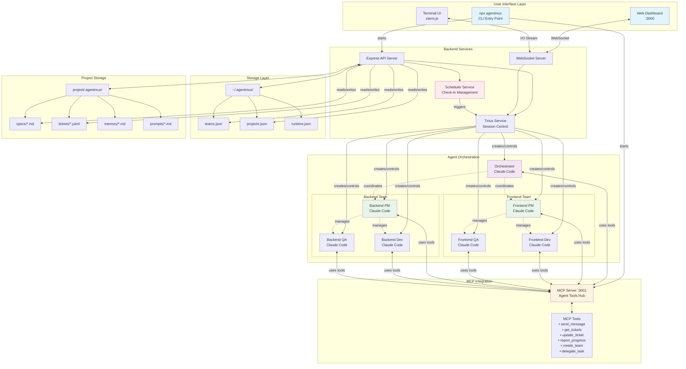

# AgentMux - Technical Specification

## System Overview

AgentMux orchestrates multiple Claude Code instances via tmux sessions, enabling autonomous team collaboration with web-based monitoring and filesystem-based persistence.

## Core Architecture

```
User → Web Dashboard → Backend Server → Tmux Sessions (Claude Code agents)
                           ↓
                      MCP Server ← All agents connect here for tools
                           ↓
                    Filesystem Storage (~/.agentmux & project/.agentmux)
```



## Technical Specification 1: Core Backend Services

### 1.1 Data Models & Storage

```typescript
// Stored in ~/.agentmux/teams.json
interface Team {
	id: string;
	name: string;
	sessionName: string; // tmux session name
	role: 'orchestrator' | 'pm' | 'developer' | 'qa';
	systemPrompt: string;
	status: 'idle' | 'working' | 'blocked' | 'terminated';
	currentProject?: string;
	currentTickets?: string[];
}

// Stored in ~/.agentmux/projects.json
interface Project {
	id: string;
	name: string;
	path: string; // absolute filesystem path
	teams: Record<string, string[]>; // team assignments
	status: string;
}

// Stored in project/.agentmux/tickets/*.yaml
interface Ticket {
	id: string;
	title: string;
	description: string;
	status: string;
	assignedTo?: string;
	// YAML frontmatter + markdown body
}
```

### 1.2 Backend Services

```typescript
// backend/src/services/tmux.service.ts
class TmuxService {
	// Create and manage tmux sessions
	createSession(config: TeamConfig): Promise<string>;
	sendMessage(target: string, message: string): Promise<void>;
	capturePane(session: string, lines?: number): Promise<string>;
	killSession(session: string): Promise<void>;
	listSessions(): Promise<SessionInfo[]>;

	// Stream terminal output to WebSocket
	streamOutput(session: string): EventEmitter;
}

// backend/src/services/scheduler.service.ts
class SchedulerService {
	private scheduledChecks: Map<string, NodeJS.Timeout>;

	// Schedule check-ins for agents
	scheduleCheck(targetSession: string, minutes: number, message: string): string;
	cancelCheck(checkId: string): void;
	listScheduledChecks(): ScheduledCheck[];

	// Execute check-in (sends message to tmux session)
	private executeCheck(targetSession: string, message: string): void;
}

// backend/src/services/storage.service.ts
class StorageService {
	// Team management (reads/writes ~/.agentmux/teams.json)
	getTeams(): Promise<Team[]>;
	saveTeam(team: Team): Promise<void>;
	updateTeamStatus(id: string, status: string): Promise<void>;

	// Project management (reads/writes ~/.agentmux/projects.json)
	getProjects(): Promise<Project[]>;
	addProject(path: string): Promise<Project>;

	// Ticket management (reads/writes project/.agentmux/tickets/)
	getTickets(projectPath: string): Promise<Ticket[]>;
	saveTicket(projectPath: string, ticket: Ticket): Promise<void>;

	// Watch filesystem for changes
	watchProject(projectPath: string): FSWatcher;
}
```

### 1.3 API Endpoints

```typescript
// backend/src/controllers/api.controller.ts

// Team Management
POST   /api/teams              // Create team & start tmux session
GET    /api/teams              // List all teams
PATCH  /api/teams/:id/status  // Update team status
DELETE /api/teams/:id          // Terminate team

// Project Management
POST   /api/projects           // Add project (with folder picker)
GET    /api/projects           // List projects
POST   /api/projects/:id/start // Start project (assign teams, cd to path)

// Ticket Management
GET    /api/projects/:id/tickets     // List tickets from filesystem
POST   /api/projects/:id/tickets     // Create ticket file
PATCH  /api/tickets/:id              // Update ticket file

// Scheduler
POST   /api/schedule           // Schedule a check-in
GET    /api/schedule           // List scheduled check-ins
DELETE /api/schedule/:id       // Cancel check-in

// Terminal
GET    /api/terminal/:session/capture  // Get terminal output
```

### 1.4 WebSocket Gateway

```typescript
// backend/src/websocket/terminal.gateway.ts
class TerminalGateway {
	// Real-time terminal streaming
	handleConnection(socket: Socket): void;
	subscribeToSession(sessionName: string, socket: Socket): void;
	sendInput(sessionName: string, input: string): void;

	// Broadcast terminal output to subscribed clients
	broadcastOutput(sessionName: string, content: string): void;
}
```

## Technical Specification 2: MCP Server

### 2.1 MCP Server Setup

```typescript
// mcp-server/src/index.ts
class AgentMuxMCP {
	// All Claude Code agents connect here
	// Each agent identifies itself via TMUX_SESSION_NAME env var

	async start(port: number): Promise<void>;

	// Register available tools for agents
	registerTools(): void {
		// Communication tools
		this.addTool('send_message', this.sendMessage);
		this.addTool('broadcast', this.broadcast);

		// Ticket management
		this.addTool('get_tickets', this.getTickets);
		this.addTool('update_ticket', this.updateTicket);
		this.addTool('create_subtask', this.createSubtask);

		// Team coordination
		this.addTool('get_team_status', this.getTeamStatus);
		this.addTool('report_progress', this.reportProgress);
		this.addTool('request_review', this.requestReview);

		// Orchestrator-only tools
		this.addTool('create_team', this.createTeam);
		this.addTool('delegate_task', this.delegateTask);
		this.addTool('schedule_check', this.scheduleCheck);
	}
}
```

### 2.2 MCP Tool Implementations

```typescript
// Tools available to all agents via MCP
interface MCPTools {
	// Inter-agent communication
	send_message(to: string, message: string): Promise<void>;

	// Ticket operations
	get_tickets(filter?: TicketFilter): Promise<Ticket[]>;
	update_ticket(id: string, updates: Partial<Ticket>): Promise<void>;

	// Progress reporting
	report_progress(ticketId: string, progress: number, notes?: string): Promise<void>;

	// Orchestrator-specific
	create_team?(role: string, name: string, prompt: string): Promise<void>;
	delegate_task?(to: string, task: string, priority: string): Promise<void>;
}
```

## Technical Specification 3: Frontend Dashboard

### 3.1 Core Components

```typescript
// frontend/src/components/

// Project Management
ProjectSelector; // Folder picker dialog
ProjectOverview; // Status of all projects
ProjectStarter; // "Start Project" button & team assignment

// Team Management
TeamCreator; // Create team with role & system prompt
TeamList; // View all teams and their status
TeamConsole; // Terminal view for specific team

// Ticket Management
TicketBoard; // Kanban-style ticket view
TicketEditor; // Create/edit tickets with markdown

// Scheduler
ScheduleManager; // View & manage scheduled check-ins
ManualScheduler; // Schedule new check-in

// Terminal
TerminalTabs; // Multiple terminal views
TerminalEmulator; // xterm.js integration with WebSocket
```

### 3.2 Real-time Features

```typescript
// frontend/src/hooks/useWebSocket.ts
function useWebSocket() {
  // Subscribe to terminal output
  subscribeToTerminal(sessionName: string): void;

  // Send keyboard input to terminal
  sendInput(sessionName: string, input: string): void;

  // Listen for file changes (tickets, specs)
  onFileChange(callback: (change: FileChange) => void): void;
}
```

## Technical Specification 4: CLI Tool

### 4.1 CLI Commands

```bash
# Start AgentMux
npx agentmux start
# → Starts backend on :3000
# → Starts MCP server on :3001
# → Opens browser to dashboard

# Other commands
npx agentmux status    # Show running teams
npx agentmux stop      # Stop all services
npx agentmux logs      # View aggregated logs
```

### 4.2 Startup Sequence

```typescript
// cli/src/commands/start.ts
async function start() {
	// 1. Ensure ~/.agentmux directory exists
	// 2. Start backend server (Express + WebSocket)
	// 3. Start MCP server for agent tools
	// 4. Open browser to http://localhost:3000
	// 5. Monitor for shutdown signals
}
```

## Testing Strategy

### Unit Tests

```typescript
// Test individual services
describe('TmuxService', () => {
	test('creates tmux session with correct parameters');
	test('sends messages with proper timing');
	test('captures pane output correctly');
});

describe('SchedulerService', () => {
	test('schedules check-ins at correct time');
	test('cancels scheduled checks');
	test('persists schedules across restarts');
});

describe('StorageService', () => {
	test('reads/writes team configurations');
	test('watches project directories for changes');
	test('parses ticket YAML correctly');
});
```

### Integration Tests

```typescript
// Test system workflows
describe('Project Workflow', () => {
	test('create project → assign teams → start agents');
	test('ticket creation → assignment → status updates');
	test('scheduled check-in → message delivery → response capture');
});

describe('MCP Integration', () => {
	test('agent connects to MCP server');
	test('agent uses tools successfully');
	test('inter-agent communication works');
});
```

### End-to-End Tests

```typescript
// Test complete user journeys
describe('User Workflows', () => {
	test('start agentmux → create project → deploy team → monitor progress');
	test('create ticket → PM assigns → Dev completes → QA verifies');
	test('schedule check-in → wait → verify execution');
});
```

## Deployment & Configuration

### Environment Variables

```bash
# ~/.agentmux/config.env
WEB_PORT=3000
AGENTMUX_MCP_PORT=3001
AGENTMUX_HOME=~/.agentmux
DEFAULT_CHECK_INTERVAL=30  # minutes
AUTO_COMMIT_INTERVAL=30    # minutes
```

### System Prompts Integration

Each agent gets a composed system prompt:

1. Base role instructions (from CLAUDE.md patterns)
2. Git discipline rules (mandatory 30-min commits)
3. Communication protocols (hub-and-spoke model)
4. MCP tool availability
5. Project-specific context

### Key Workflows

1. **Project Start**: User selects folder → Teams assigned → Agents CD to project → Start Claude Code
2. **Ticket Flow**: PM creates from spec → Assigns to Dev → Dev updates status → QA verifies → Done
3. **Check-ins**: Scheduler triggers → Message sent to tmux → Agent responds → Captured in logs
4. **Communication**: Agent uses MCP tool → Backend receives → Routes to target tmux session
